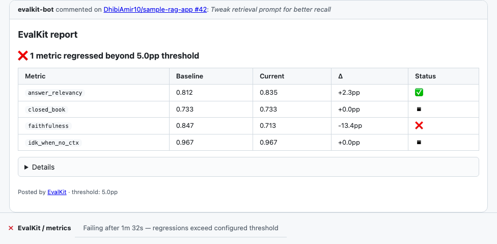

# EvalKit: a production eval harness for LLM apps

*Draft launch post for HN / r/MachineLearning / personal blog.*

---

I shipped LLM features into production three times in 2025. The first two
times I told myself I'd "add evals next sprint." The third time I started
the sprint with the evals and only then changed the prompt. That sprint was
the one where nothing exploded in production.

So I extracted the harness I'd been rebuilding every time and made it OSS:
**[EvalKit](https://github.com/AmirD10224/eval-kit)**, synthetic data,
calibrated LLM-as-judge, regression detection, and a GitHub Action that
auto-rejects regressing PRs. MIT, `pip install evalkit-oss`.

## What's the actual problem?

Most "eval frameworks" stop at "compute a score." They don't tell you
whether to trust the score. So in practice, teams either:

- **Trust the LLM judge naively.** Then a model upgrade, a prompt tweak, or
  a benign refactor silently changes "5.0/5" into "3.0/5" with no signal.
  The judge drifted; the app didn't.
- **Skip evals and ship on vibes.** Fine until the second PR.

The thing I kept rebuilding: a small library that **calibrates the judge
against humans on a golden set** and refuses to deploy when agreement is
too low. Cohen's κ ≥ 0.7, position-bias audit, length-bias audit, self-
preference-bias audit. If any of those fail, the judge isn't trustworthy
and the eval results are noise.

EvalKit makes that calibration step three lines:

```python
judge = CalibratedJudge.from_rubric("rubrics/faithfulness.yaml")
report = judge.calibrate("golden.jsonl")
assert report.passes, report.failure_reason
```

## The flagship demo

A PR drops faithfulness by 13.4 percentage points. The EvalKit GitHub Action
runs the suite, posts a comment with the diff, and fails the check:



That's the difference between "we improved the prompt" and "we improved the
prompt and have evidence."

## What's in the box

- **Synthetic data** with a taxonomy: `edge_cases`, `jailbreaks`,
  `multi_turn`, `pii_probes`, `distribution_shift`. Provenance tracking
  per row.
- **Golden datasets** as JSONL with schema validation, multi-rater
  agreement (Cohen's & Fleiss' κ, Krippendorff's α with proper handling of
  multi-digit ordinal labels, plus the κ-paradox indices and Gwet's AC₁),
  git-based versioning.
- **Calibrated LLM-as-judge** with bias audits.
- **Eval runner** with parallel metric execution and Rich-pretty terminal
  output.
- **Regression diff** with configurable thresholds.
- **GitHub Action** that posts a Markdown PR comment and gates the merge.
- **Adapters** for Ragas, Inspect AI, promptfoo, Langfuse, Braintrust.

## What it's not

- **A dashboard.** Use Langfuse or Braintrust if you want a UI; EvalKit
  pushes scores into both.
- **A vector store.** It evaluates RAG; it doesn't host one.
- **A prompt manager.** Same, orthogonal.

## Try it

```bash
pip install evalkit-oss
git clone https://github.com/AmirD10224/eval-kit.git
cd eval-kit/examples/qa-rag
evalkit dataset validate golden.jsonl
evalkit run --suite suite.yaml --output current.json
```

Issues, ideas, PRs welcome:
[github.com/AmirD10224/eval-kit](https://github.com/AmirD10224/eval-kit).

- Amir
